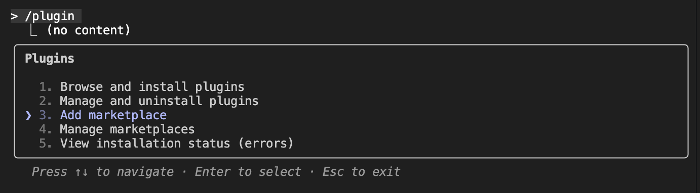
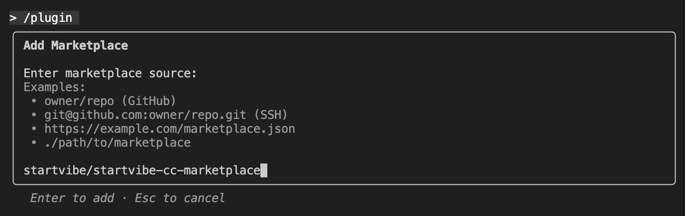
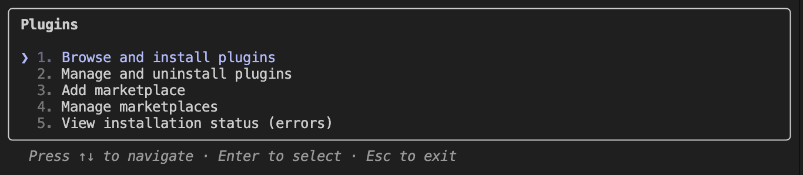
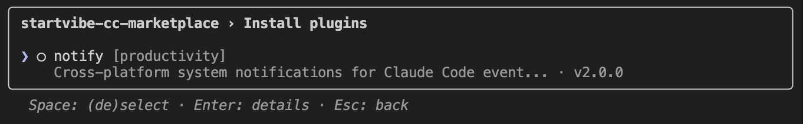
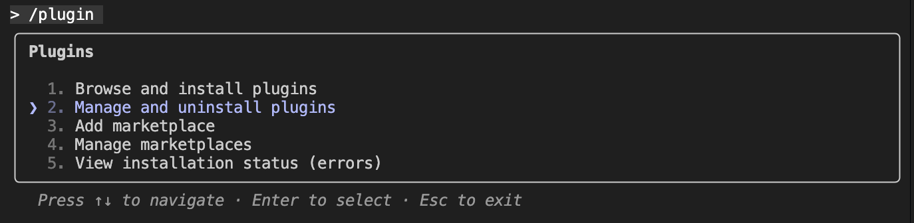
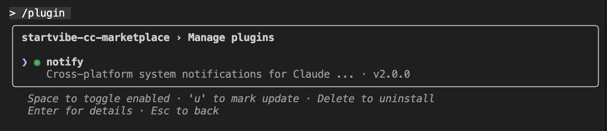

# StartVibe Claude Code 插件市场

> 为 StartVibe 提供的 Claude Code 插件开发和分发平台

## 📖 项目简介

基于 Node.js 的 Claude Code 插件市场，使用原生系统通知工具，提供轻量级、跨平台的插件解决方案。

### ✨ 核心特性

- **原生通知调用**：通过 Node.js child_process 调用 osascript (macOS)、notify-send (Linux)、PowerShell (Windows)
- **零第三方依赖**：仅使用 Node.js 内置模块 (child_process, fs, path)
- **高性能**：Hook 响应时间 < 2秒，直接调用系统原生通知工具
- **上下文感知**：自动识别项目名称和会话信息
- **跨平台兼容**：完整支持 macOS、Windows、Linux

## 🚀 快速开始

### 前置要求

- Claude Code 已安装并运行

### 安装

#### 方法一：交互式安装

在claude code中执行"/plugin"指令，进入插件管理模式，根据提示逐步操作:

1. 添加marketplace：
   
   
   marketplace可选源：
   - Github源：startvibe/startvibe-cc-marketplace
   - Gitee源（国内）：https://gitee.com/startvibe/startvibe-cc-marketplace.git

2. 安装插件：
   
   

3. 启用插件（如果为启用状态则需要手动启用）：
   
   

#### 方法二：指令安装

1. **添加市场到 Claude Code**

   ```bash
   # 在 Claude Code 中运行
   ## 从Github安装marketplace
   /plugin marketplace add startvibe/startvibe-cc-marketplace
   ## 或从Gitee安装marketplace（国内无法访问Github可以使用此源）
   /plugin marketplace add https://gitee.com/startvibe/startvibe-cc-marketplace.git
   ```

2. **安装可用插件**

   ```bash
   # 安装通知插件
   /plugin install notify@startvibe-cc-marketplace

   # 启用通知插件
   /plugin enable notify@startvibe-cc-marketplace

   # 查看所有可用插件
   /plugin
   ```

3. **验证安装**

   ```bash
   # 检查已安装插件
   /plugin list

   # 测试插件功能
   /plugin status notify
   ```

### 可用插件

#### 🔔 Notify 插件 - Node.js 实现版本

**核心架构**：单个 Node.js 脚本，通过 child_process 调用原生系统通知工具。

- **实现方式**：
  - macOS: `osascript` - AppleScript 系统通知
  - Linux: `notify-send` - Desktop Notifications Protocol
  - Windows: `PowerShell` - System.Windows.Forms NotifyIcon

- **技术特性**：
  - 🚀 **零第三方依赖** - 仅使用 Node.js 内置模块
  - ⚡ **毫秒级响应** - Hook 响应时间 < 2秒
  - 🔧 **安全处理** - 非阻塞进程管理，自动清理
  - 📱 **上下文感知** - 自动提取项目名和会话信息

**文件结构**：

```
scripts/
└── notify-hook.js           # 21KB 综合处理脚本
```

详细说明：[plugins/notify/README.md](plugins/notify/README.md)

## 📁 项目结构

```
startvibe-cc-marketplace/
├── .claude-plugin/               # Claude Code 市场配置
│   └── marketplace.json         # 市场配置文件
├── plugins/                     # 插件目录
│   └── notify/                  # 通知插件 (v2.0.0)
│       ├── .claude-plugin/
│       │   └── plugin.json     # 插件元数据
│       ├── hooks/
│       │   └── hooks.json      # Hook 事件配置
│       ├── scripts/
│       │   └── notify-hook.js  # 21KB 综合通知处理脚本
│       ├── config/
│       │   └── notify-config.json # JSON 配置文件
│       └── README.md            # 插件详细文档
├── specs/                       # 规格和契约目录
│   ├── 001-project-config/      # 项目配置规格
│   │   └── contracts/           # 配置文件契约
│   └── 002-notify-plugin/       # 通知插件规格
│       └── contracts/           # 插件配置契约
├── docs/                        # 文档目录
│   └── claude-code-docs/        # Claude Code 中文文档
└── README.md                    # 本文档
```

## 🧪 测试

```bash

# 测试通知功能
echo '{"hook_event_name":"Stop","cwd":"/test/project"}' | node plugins/notify/scripts/notify-hook.js
```

## 📄 许可证

本项目采用 [Apache License 2.0](LICENSE)。

## 🙏 致谢

感谢 Claude Code 团队提供优秀的插件生态系统，以及所有为开源社区做出贡献的开发者。

## 📞 联系方式

- **项目维护者**：Jianan
- **邮箱**：startvibe@linlaoshi.top
- **网址**：https://startvibe.linlaoshi.top

---

**StartVibe Claude Code 插件市场** - 让开发更高效，让插件更简单。
