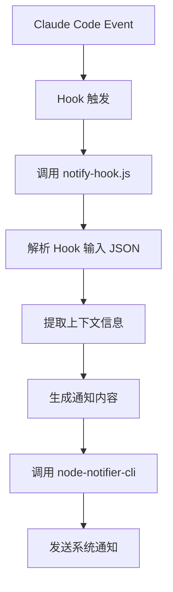

# Claude Code 通知插件

基于 @startvibe/node-notifier-cli 的上下文感知跨平台系统通知插件，为 Claude Code 提供即时的桌面通知功能。

## ✨ 特性

- 🚀 **零配置即装即用** - 直接使用 @startvibe/node-notifier-cli，无需额外设置
- 🌍 **跨平台支持** - 基于 node-notifier，完整支持 macOS、Windows、Linux
- ⚡ **高性能** - Hook 响应时间 < 2秒，通过 npx 自动处理依赖
- 🎯 **上下文感知** - 自动提取项目信息，在通知中显示是哪个项目的操作
- 📱 **智能事件监听** - 监听 Claude Code 的 Stop 和 Notification 事件
- 🔧 **自动回退** - 本地命令失败时自动使用 npx 下载包执行

## 🏗️ 系统架构

### 技术栈

- **核心依赖**: @startvibe/node-notifier-cli (跨平台通知CLI)
- **事件处理**: Claude Code Hooks 系统
- **上下文解析**: JavaScript (Node.js)
- **通知发送**: npx + @startvibe/node-notifier-cli

### 支持平台

| 操作系统 | 通知实现      | 状态      | 要求                           |
| -------- | ------------- | --------- | ------------------------------ |
| macOS    | native-notifier | ✅ 自动   | 自动下载依赖                   |
| Linux    | notify-send   | ✅ 自动   | 自动下载依赖                   |
| Windows  | PowerShell    | ✅ 自动   | 自动下载依赖                   |

## 📦 安装说明

### 方法一：Claude Code Marketplace 安装（推荐）

```bash
# 在 Claude Code 中运行
/plugin marketplace add startvibe/startvibe-cc-marketplace

# 安装通知插件
/plugin install notify@startvibe-cc-marketplace

# 验证安装
/plugin list
```

### 方法二：手动安装

```bash
# 1. 克隆到 Claude Code 插件目录
cd ~/.claude
git clone https://github.com/startvibe/startvibe-cc-marketplace

# 2. 设置执行权限
chmod +x plugins/notify/scripts/notify-hook.js

# 3. 启动 Claude Code（即时可用）
claude
```

## 🚀 快速开始

### 基础使用

安装后，插件将自动工作：

1. **Claude 完成响应时** - 收到带项目名的 "Claude 响应完成" 通知
2. **需要用户交互时** - 收到带项目名的 "Claude 需要注意" 通知

### 通知示例

**Stop 事件**：
```
标题: Claude 响应完成
消息: my-awesome-project - Claude 已完成您的请求处理
项目: my-awesome-project
```

**Notification 事件**：
```
标题: Claude 需要注意
消息: my-awesome-project - Claude 需要您的权限来使用 Bash
项目: my-awesome-project
```

### 手动测试

```bash
# 测试 notify hook 脚本
node plugins/notify/scripts/notify-hook.js

# 直接测试 node-notifier-cli
npx @startvibe/node-notifier-cli notify -t "测试标题" -m "测试消息" -s
```

## ⚙️ Hook 上下文信息

插件会自动从 Claude Code Hook 输入中提取以下信息：

### 可用的上下文数据

- **`session_id`** - Claude 会话唯一标识符
- **`cwd`** - 当前工作目录（用于提取项目名称）
- **`permission_mode`** - 当前权限模式（default、plan、acceptEdits 等）
- **`hook_event_name`** - Hook 事件类型（Stop、Notification 等）
- **`message`** - Notification 事件的原始消息内容
- **`transcript_path`** - 对话记录文件路径

### 上下文提取逻辑

```javascript
// 项目名称提取
const projectName = cwd.split(/[\\/]/).pop() || 'Unknown';

// 会话ID简化显示
const sessionIdShort = session_id.slice(0, 8);

// 事件类型识别
if (hook_event_name === 'Stop') {
  title = 'Claude 响应完成';
  message = `${projectName} - Claude 已完成您的请求处理`;
} else if (hook_event_name === 'Notification') {
  title = 'Claude 需要注意';
  message = `${projectName} - ${message || 'Claude 需要您的确认或输入'}`;
}
```

## 🔧 自定义配置

### 配置文件

插件使用 `config/notify-config.json` 配置文件来管理通知内容，支持完全自定义：

```json
{
  "version": "2.0.0",
  "events": {
    "Stop": {
      "enabled": true,
      "title": "Claude 响应完成",
      "messageTemplate": "{{projectName}} - Claude 已完成您的请求处理",
      "sound": true,
      "includeProjectInfo": true
    },
    "Notification": {
      "enabled": true,
      "title": "Claude 需要注意",
      "messageTemplate": "{{projectName}} - {{message}}",
      "fallbackMessage": "{{projectName}} - Claude 需要您的确认或输入",
      "sound": true,
      "includeProjectInfo": true
    }
  },
  "display": {
    "includeSessionInfo": false,
    "includePermissionMode": false,
    "maxMessageLength": 200
  }
}
```

### 可用模板变量

在 `messageTemplate` 和 `fallbackMessage` 中可以使用以下变量：

- `{{projectName}}` - 项目名称（从当前目录路径提取）
- `{{currentDir}}` - 当前目录路径
- `{{sessionId}}` - 会话ID（前8位）
- `{{message}}` - Notification 事件的原始消息
- `{{permissionMode}}` - 当前权限模式
- `{{eventName}}` - Hook 事件名称

### 配置选项说明

#### 事件配置 (events)

- **enabled** - 是否启用该事件的通知
- **title** - 通知标题
- **messageTemplate** - 消息模板，支持变量替换
- **fallbackMessage** - 当没有消息时的备用模板
- **sound** - 是否播放通知声音
- **includeProjectInfo** - 是否在消息中包含项目信息

#### 显示配置 (display)

- **includeSessionInfo** - 是否包含会话信息
- **includePermissionMode** - 是否包含权限模式信息
- **maxMessageLength** - 消息最大长度，超出会被截断

### 自定义示例

#### 简洁风格配置

```json
{
  "events": {
    "Stop": {
      "title": "✅ 完成",
      "messageTemplate": "{{projectName}}",
      "sound": false,
      "includeProjectInfo": false
    },
    "Notification": {
      "title": "⚠️ 注意",
      "messageTemplate": "{{projectName}}: {{message}}",
      "sound": true,
      "includeProjectInfo": false
    }
  },
  "display": {
    "maxMessageLength": 100
  }
}
```

#### 详细信息配置

```json
{
  "events": {
    "Stop": {
      "title": "Claude 任务完成 🎉",
      "messageTemplate": "项目: {{projectName}}\n目录: {{currentDir}}\n会话: {{sessionId}}",
      "sound": true,
      "includeProjectInfo": false
    },
    "Notification": {
      "title": "Claude 需要您的注意 📍",
      "messageTemplate": "{{projectName}}\n\n{{message}}",
      "fallbackMessage": "{{projectName}} - Claude 需要您的确认或输入",
      "sound": true,
      "includeProjectInfo": true
    }
  },
  "display": {
    "includeSessionInfo": true,
    "includePermissionMode": true,
    "maxMessageLength": 300
  }
}
```

### 禁用特定事件

```json
{
  "events": {
    "Stop": {
      "enabled": false,
      "title": "Claude 响应完成",
      "messageTemplate": "{{projectName}} - Claude 已完成您的请求处理"
    },
    "Notification": {
      "enabled": true,
      "title": "Claude 需要注意",
      "messageTemplate": "{{projectName}} - {{message}}"
    }
  }
}
```

## 🧪 测试和验证

### 手动测试

1. **Stop 事件测试**

   ```bash
   # 在 Claude Code 中运行一个简单任务
   "请简单回复：测试完成"
   # 应该收到通知：项目名 - Claude 响应完成
   ```

2. **Notification 事件测试**

   ```bash
   # 触发需要权限的操作
   "请访问系统文件 /etc/passwd"
   # 应该收到通知：项目名 - Claude 需要您的权限来使用 Bash
   ```

### 跨平台验证

测试 node-notifier-cli 在不同平台的兼容性：

```bash
# 测试通知功能
npx @startvibe/node-notifier-cli notify -t "平台测试" -m "这是测试消息" -s

# 测试不同选项
npx @startvibe/node-notifier-cli notify -t "测试" -m "消息" -s -i "https://example.com/icon.png"
```

### Hook 输入测试

模拟 hook 输入来测试上下文解析：

```bash
# 创建测试输入
echo '{"session_id":"test123","cwd":"/path/to/my-project","hook_event_name":"Stop","permission_mode":"default"}' | node scripts/notify-hook.js
```

## 🐛 故障排除

### 常见问题

#### 通知不显示

1. **检查插件是否正确安装**

   ```bash
   # 检查插件列表
   /plugin list

   # 查看插件状态
   /plugin
   ```

2. **验证 node-notifier-cli 可用性**

   ```bash
   # 直接测试 node-notifier-cli
   npx @startvibe/node-notifier-cli notify -t "测试" -m "测试消息"
   ```

3. **检查 hook 脚本**

   ```bash
   # 测试 hook 脚本
   node plugins/notify/scripts/notify-hook.js

   # 检查脚本权限
   ls -la plugins/notify/scripts/notify-hook.js
   ```

4. **检查系统通知权限**
   - macOS: 系统偏好设置 → 安全性与隐私 → 通知
   - Windows: 设置 → 系统 → 通知
   - Linux: 桌面环境通知设置

5. **查看 Claude Code 日志**

   ```bash
   # 使用调试模式启动 Claude Code
   claude --debug

   # 查看 hook 执行日志
   tail -f ~/.claude/logs/claude.log
   ```

#### npx 下载失败

```bash
# 清理 npm 缓存
npm cache clean --force

# 强制重新下载
npx --yes @startvibe/node-notifier-cli notify -t "测试" -m "测试"
```

#### Hook 脚本执行错误

1. **检查 Node.js 版本**
   ```bash
   node --version  # 需要 >= 14.0.0
   ```

2. **验证脚本语法**
   ```bash
   node -c plugins/notify/scripts/notify-hook.js
   ```

3. **模拟 hook 输入测试**
   ```bash
   echo '{"hook_event_name":"Stop","cwd":"/test","session_id":"test"}' | node plugins/notify/scripts/notify-hook.js
   ```

### 性能优化

- Hook 超时设置为 20 秒，给 npx 足够时间下载依赖
- 本地有 `notify` 命令时会优先使用，避免 npx 下载
- 通知内容简洁，避免过长消息影响显示

## 📋 开发指南

### 目录结构

```
plugins/notify/
├── .claude-plugin/
│   └── plugin.json          # 插件元数据
├── hooks/
│   └── hooks.json           # Hook 配置
├── scripts/
│   └── notify-hook.js       # 上下文感知的通知脚本
├── config/
│   └── notify-config.json   # 通知配置文件
└── README.md               # 本文档
```

### Hook 事件处理

插件监听以下 Claude Code Hook 事件：

1. **Stop** - Claude 完成响应时发送带项目名的通知
2. **Notification** - 需要用户交互时发送带项目名的通知

### 核心工作流程



### 上下文解析逻辑

```javascript
// 1. 从 stdin 读取 hook 输入
const hookData = JSON.parse(input);

// 2. 提取有用信息
const { cwd, session_id, hook_event_name, message } = hookData;

// 3. 生成项目名称
const projectName = cwd.split(/[\\/]/).pop() || 'Unknown';

// 4. 根据事件类型生成通知
if (hook_event_name === 'Stop') {
  title = 'Claude 响应完成';
  messageText = `${projectName} - Claude 已完成您的请求处理`;
}
```

## 🤝 贡献指南

1. Fork 项目
2. 创建功能分支 (`git checkout -b feature/amazing-feature`)
3. 提交更改 (`git commit -m 'Add amazing feature'`)
4. 推送到分支 (`git push origin feature/amazing-feature`)
5. 开启 Pull Request

## 📄 许可证

本项目采用 Apache License 2.0 许可证。

## 🙏 致谢

- Claude Code 团队提供优秀的 Hook 系统
- @startvibe/node-notifier-cli 提供跨平台通知支持
- 开源社区的宝贵反馈和建议

## 📞 支持

- **问题报告**: [GitHub Issues](https://github.com/startvibe/startvibe-cc-marketplace/issues)
- **功能请求**: [GitHub Discussions](https://github.com/startvibe/startvibe-cc-marketplace/discussions)

---

**享受您的上下文感知 Claude Code 通知体验！** 🎉
