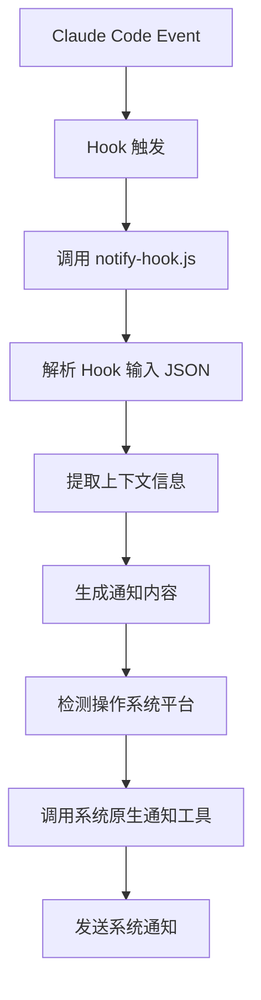

# Claude Code 通知插件

基于 Node.js 的上下文感知跨平台系统通知插件，直接调用系统原生通知工具，提供零依赖的高性能通知体验。

## ✨ 特性

- 🚀 **零第三方依赖** - 仅使用 Node.js 内置模块 (child_process, fs, path)
- ⚡ **高性能** - Hook 响应时间 < 2秒，直接调用系统原生工具
- 🌍 **跨平台支持** - 完整支持 macOS、Windows、Linux 原生通知
- 🎯 **上下文感知** - 自动提取项目信息，显示是哪个项目的操作
- 📱 **智能事件监听** - 监听 Claude Code 的 Stop 和 Notification 事件
- 🔧 **安全处理** - 非阻塞进程管理，自动超时清理

## 🏗️ 系统架构

### 技术栈

- **核心**: Node.js 内置模块 (child_process, fs, path)
- **事件处理**: Claude Code Hooks 系统
- **通知方式**: 直接调用系统原生工具

### 支持平台

| 操作系统 | 通知实现    | 状态    | 命令             |
| -------- | ----------- | ------- | ---------------- |
| macOS    | osascript   | ✅ 原生 | `osascript -e`   |
| Linux    | notify-send | ✅ 原生 | `notify-send`    |
| Windows  | PowerShell  | ✅ 原生 | `powershell.exe` |

## 📦 安装说明

### Claude Code Marketplace 安装（推荐）

```bash
# 在 Claude Code 中运行

# 安装marketplace
## 从Github安装marketplace
/plugin marketplace add startvibe/startvibe-cc-marketplace
## 或从Gitee安装marketplace（国内无法访问Github可以使用此源）
/plugin marketplace add https://gitee.com/startvibe/startvibe-cc-marketplace.git

# 安装通知插件
/plugin install notify@startvibe-cc-marketplace

# 启用通知插件
/plugin enable notify@startvibe-cc-marketplace

# 验证安装
/plugin list
```

## 🚀 快速开始

### 基础使用

安装后，插件将自动工作：

1. **Claude 完成响应时** - 收到带项目名的 "Claude 响应完成" 通知
2. **需要用户交互时** - 收到带项目名的 "Claude 需要注意" 通知

### 通知示例

**Stop 事件**：

```
标题: Claude 响应完成
消息: my-awesome-project - Claude 已完成您的请求处理
```

**Notification 事件**：

```
标题: Claude 需要注意
消息: my-awesome-project - Claude 需要您的权限来使用 Bash
```

## ⚙️ Hook 上下文信息

插件会自动从 Claude Code Hook 输入中提取以下信息：

### 可用的上下文数据

- **`session_id`** - Claude 会话唯一标识符
- **`cwd`** - 当前工作目录（用于提取项目名称）
- **`hook_event_name`** - Hook 事件类型（Stop、Notification 等）
- **`message`** - Notification 事件的原始消息内容

### 上下文提取逻辑

```javascript
// 项目名称提取
const projectName = cwd.split(/[\\/]/).pop() || 'Unknown';

// 事件类型识别
if (hook_event_name === 'Stop') {
  title = 'Claude 响应完成';
  message = `${projectName} - Claude 已完成您的请求处理`;
} else if (hook_event_name === 'Notification') {
  title = 'Claude 需要注意';
  message = `${projectName} - ${message || 'Claude 需要您的确认或输入'}`;
}
```

## 🔧 自定义配置

插件使用 `config/notify-config.json` 配置文件来管理通知内容：

```json
{
  "version": "2.0.0",
  "events": {
    "Stop": {
      "enabled": true,
      "title": "Claude 响应完成",
      "messageTemplate": "{{projectName}} - Claude 已完成您的请求处理",
      "sound": true,
      "includeProjectInfo": true
    },
    "Notification": {
      "enabled": true,
      "title": "Claude 需要注意",
      "messageTemplate": "{{projectName}} - {{message}}",
      "fallbackMessage": "{{projectName}} - Claude 需要您的确认或输入",
      "sound": true,
      "includeProjectInfo": true
    }
  },
  "display": {
    "includeSessionInfo": false,
    "includePermissionMode": false,
    "maxMessageLength": 200
  },
  "notification": {
    "preferNativeWindows": true,
    "preferNativeMacOS": true,
    "timeout": {
      "processCleanup": 6000,
      "hookInput": 5000
    }
  }
}
```

### 可用模板变量

- `{{projectName}}` - 项目名称（从当前目录路径提取）
- `{{currentDir}}` - 当前目录路径
- `{{sessionId}}` - 会话ID（前8位）
- `{{message}}` - Notification 事件的原始消息
- `{{eventName}}` - Hook 事件名称

## 🧪 测试和验证

### 手动测试

```bash
# 测试 Stop 事件
echo '{"hook_event_name":"Stop","cwd":"/path/to/my-project","session_id":"test123"}' | node plugins/notify/scripts/notify-hook.js

# 测试 Notification 事件
echo '{"hook_event_name":"Notification","cwd":"/path/to/my-project","message":"需要权限使用 Bash","session_id":"test123"}' | node plugins/notify/scripts/notify-hook.js
```

### 跨平台验证

测试不同平台的原生通知：

```bash
# macOS 测试
osascript -e 'display notification "测试消息" with title "测试标题"'

# Linux 测试
notify-send "测试标题" "测试消息"

# Windows 测试
powershell -Command "Add-Type -AssemblyName System.Windows.Forms; $n = New-Object System.Windows.Forms.NotifyIcon; $n.BalloonTipTitle = '测试标题'; $n.BalloonTipText = '测试消息'; $n.Visible = \$true; $n.ShowBalloonTip(3000); $n.Dispose()"
```

## 🐛 故障排除

### 常见问题

#### 通知不显示

1. **检查插件是否正确安装**

   ```bash
   /plugin list
   ```

2. **验证系统通知功能**

   ```bash
   # macOS
   osascript -e 'display notification "测试" with title "测试"'

   # Linux
   notify-send "测试" "测试"

   # Windows
   powershell -Command "Add-Type -AssemblyName System.Windows.Forms; $n = New-Object System.Windows.Forms.NotifyIcon; $n.BalloonTipTitle = '测试'; $n.BalloonTipText = '测试'; $n.Visible = \$true; $n.ShowBalloonTip(3000); $n.Dispose()"
   ```

3. **检查系统通知权限**
   - macOS: 系统偏好设置 → 安全性与隐私 → 通知
   - Windows: 设置 → 系统 → 通知和操作
   - Linux: 桌面环境通知设置

#### Hook 脚本执行错误

1. **检查 Node.js 版本**

   ```bash
   node --version  # 需要 >= 14.0.0
   ```

2. **验证脚本语法**
   ```bash
   node -c plugins/notify/scripts/notify-hook.js
   ```

### 性能特点

- **单文件架构**: 21KB 综合处理脚本
- **即时启动**: 无需下载外部依赖
- **非阻塞处理**: 自动进程管理和清理
- **详细日志**: 完整的调试信息

## 📋 开发指南

### 目录结构

```
plugins/notify/
├── .claude-plugin/
│   └── plugin.json          # 插件元数据
├── hooks/
│   └── hooks.json           # Hook 配置
├── scripts/
│   └── notify-hook.js       # 21KB 综合处理脚本
├── config/
│   └── notify-config.json   # 配置文件
└── README.md               # 本文档
```

### Hook 事件处理

插件监听以下 Claude Code Hook 事件：

1. **Stop** - Claude 完成响应时发送通知
2. **Notification** - 需要用户交互时发送通知

### 核心工作流程



## 📄 许可证

本项目采用 Apache License 2.0 许可证。

## 📞 支持

- **问题报告**: [GitHub Issues](https://github.com/startvibe/startvibe-cc-marketplace/issues)
- **功能请求**: [GitHub Discussions](https://github.com/startvibe/startvibe-cc-marketplace/discussions)

---

**享受您的零依赖 Claude Code 通知体验！** 🎉
